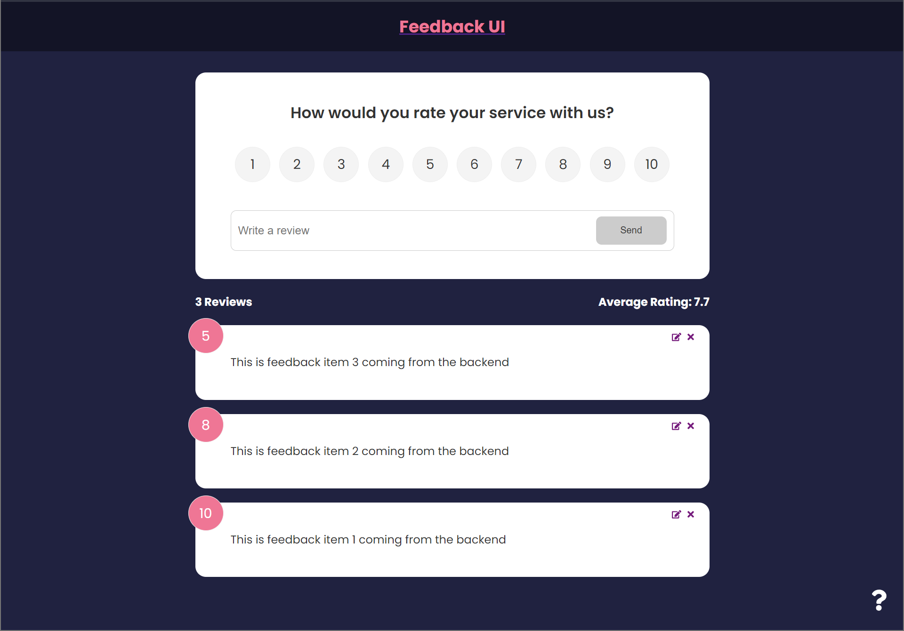

# Feedback App



## Description

A simple mock feedback app built with React.

### Why?

I built this as part of a Udemy course I was using to learn React from the ground up.

## Installation

Here are the things you'll need if you want to run this project locally:

1. [NodeJS](https://nodejs.org/en/download)

Once the above is installed:

1. Clone this repository
2. Open a terminal and navigate to the project's root directory
3. Install the required packages via NPM

   ```shell
   npm install
   ```

## Usage

To run the project locally, you'll need to run both the client and the server:

```shell
npm run dev
```
